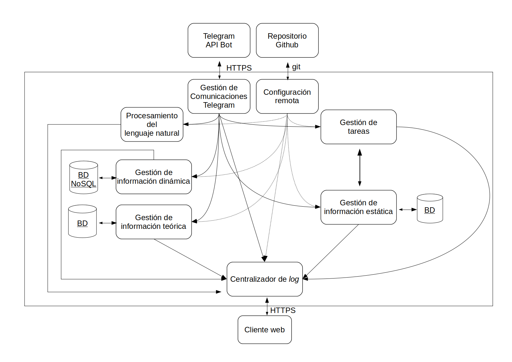

#	C-ProfessorBot
##	Proyecto de la asignatura Cloud Computing Fundamentos y estructura

Proyecto llevado a cabo en la asignatura **Cloud Computing. Fundamentos y estructura** del **Máster de Ingeniería Informática** en la Universidad de Granada consistente en la aplicación de herramientas y metodologías de **Cloud Computing** para el despliegue de una ampliación sobre el sistema servidor **CProfessorBot** desarrollado como Trabajo de Fin de Grado en la Universidad de Córdoba durante el curso 18/19, el cual puede ser consultado en el siguiente 

####	Descripción del Proyecto

El proyecto pretende ampliar las características del sistema CProfessorBot, en el cual, el procesamiento de todas las peticiones de todos sus usuarios recaía en un único sistema servidor monolítico *multithreading*.

Esta ampliación, pretende reestructurar la arquitectura del servidor a una arquitectura Cloud Computing, de forma que se permita desplegar de forma independiente cada uno de los módulos funcionales del sistema original en los diferentes microservicios con el objetivo de aumentar las capacidades del sistema:

- Aumento de la disponibilidad del sistema: Se espera que esta arquitectura permita extender el uso del sistema a un mayor número de usuarios y a un mayor número de asignaturas (la implementación actual únicamente soporta una única asignatura por servidor).

- Aumento de las capacidades de cómputo del sistema servidor, especialmente en los módulos que implementan los algoritmos de procesamiento del lenguaje natural y los algoritmos de búsqueda y recuperación de las bases de datos, cuyo coste se incrementa sustancialmente con el tamaño de la información a procesar y, en su versión actual, son ejecutados por algún hilo del servidor monolítico.

El sistema originalmente se podría descomponer funcionalmente de la siguiente forma:

- Módulo de comunicación: Se ocupa de recibir las peticiones emitidas por los usuarios al asistente y de remitir esta información al núcleo del sistema para su tratamiento. También se encarga de enviar las respuestas generadas por el sistema a sus usuarios. Este módulo se comunica directamente con los servidores de la plataforma Telegram gracias a su API.

- Módulo de gestión del sistema: Organizar el funcionamiento del sistema coordinando al resto de módulos. En el sistema original, por simplicidad del servidor, la funcionalidad de este módulo y del anterior fueron desarrolladas en la clase principal del sistema.

- Módulo de gestión de información: Gestiona y almacena toda la información necesaria: Información de los usuarios, foros de docencia, mensajes enciados o recibidos y la información teórica almacenada.

- Módulo de procesamiento del lenguaje natural: Se encarga de aplicar todos los algoritmos de procesamiento del lenguaje natural en los procesos en los que se requiere (análisis de los conceptos preguntados en las pregunta y evaluación de la temática de conversación de los mensajes principalmente) y devolver una respuesta.

Por su parte, CProfessorBot constituye un asistente conversacional, chatbot o simplemente bot docente e inteligente que interopera por medio de la plataforma de mensajería **Telegram**, para interactuar con los usuarios, bien en un chat grupal de alumn@s, o bien en chats privados, para recibir consultas teóricas formuladas en lenguaje natural y tratar de responder a las mismas en estos chats. El sistema incluye otras funcionalidades como la capacidad de evaluación de la temática de conversación de los mensajes emitidos por el alumnado, la gestión de los foros de docencia, recopilación de información sobre el uso del sistema y de los foros docentes por parte del alumnado, etc.

####	Descripción de la Arquitectura

Se desea implementar este sistema servidor en una arquitectura basada en **microservicios** conectados entre sí. Existe cierta correspondencia entre la descomposición funcional anteriormente expuesta y los microservicios que se desarrollan a continuación.

#####	Microservicios a desarrollar

Se consideran los siguientes microservicios:

- Gestión de comunicaciones Telegram: Implementa toda la funcionalidad del módulo de comunicación, actuando como mediador entre sistema y los usuarios de la plataforma Telegram. Hace uso de la API  para interconectar con la interfaz del bot, de la cual recoje todas las peticiones de los usuarios y a la cual emite todas las respuestas generadas por el sistema.

Este microservicio se comunicará con el resto de microservicios para llevar a cabo el procesamiento de todas las peticiones recibidas.

- Procesamiento del lenguaje natural: Implementa el módulo de procesamiento del lenguaje natural. Realiza diferentes tareas de procesamiento del lenguaje natural a petición del microservicio de comuncaciones y devuelve el resultado.

- Gestión de información estática: Implementa parte de la funcionalidad del módulo de gestión de la información y se ocupa de gestionar la información a almacenar por el sistema de naturaleza estática (información sobre los usuarios (alumnos y profesores) registrados, información sobre los foros docentes y de los usuarios registrados en los mismos, información sobre las asignaturas, los profesores encargados de su docencia, el alumnado matriculado en las mismas, configuración establecida etc).

Este microservicio se hallará conectado a una base de datos de tipo relacional que permite modelar y gestionar información de esta naturaleza de forma más adecuada proveyendo mecanismos aprovechables para garantizar la integridad de la información y una rápida capacidad de respuesta en los procesos de recuperación de la información.

- Gestión de información dinámica: Se ocupa de gestionar y almacenar información de naturaleza dinámica y cambiante que es creada y desruída de forma masiva en cortos periodos de tiempo, lo que imposibilita su almacenamiento estructurado (registro de mensajes enviados o recibidos por el sistema con toda su información textual o multimedia y cualquier otra información recopilada sobre el uso del sistema por parte de sus usuarios).

Este microservicio se conectará a otra base de datos que se adapte a la naturaleza de esta información. Se optará por algún tipo de base de datos NoSQL de tipo documental.

- Gestión de la información docente: Se encarga de gestionar y almacenar la información teórica empleada por el sistema para atender a las consultas teóricas del alumnado y para evaluar la temática de los mensajes recibidos por el mismo. Para este fin, deberá de implementar los mecanismos necesarios tanto para realizar búsquedas inteligentes de la información teórica almacenada, como para acceder de forma rápida a esta información, para lo que se requerirá en ambos casos que la información esté adecuadamente estructurada e indexada.

Se plantea inicialmente la conexión de este microservicio con un tipo de base de datos relacional que haga un uso intenso de indexación de contenidos.

- Gestión de tareas del sistema: Se encargará de registrar y ordenar la ejecución de tareas programadas como resultado de alguna petición de alguno de sus usuarios (por ejemplo, envío de notificaciones programadas por el profesorado al alumnado en una fecha y hora determinadas), para tal objetivo, deberá de gestionar una cola de tareas. Este microservicio requerirá comunicación con el microservicio "Gestión de información estática" para almacenar y recuperar toda la información que requiere.

- Configuración remota: Se ocupará de recoger la configuración establecida en un repositorio de GitHub y aplicar dicha configuración sobre el resto de microservicios.

- Centralizador de *log*: Se ocupa de centralizar el registro de los eventos y acciones llevadas a cabo como consecuencia del funcionamiento del sistema y permitir la consulta de esta información por medio de un servicio web.

En el siguiente diagrama, se representa esta arquitectura de microservicios. Se ha de aclarar que la comunicación entre los microservicios se efectúa mediante el protocolo *AMQP*.

#####	Tecnologías usadas

Se plantea usar el lenguaje Python en la implementación de todos los microservicios haciendo uso del *framework* Flask.

Python constituye una buena opción al existir numerosas herramientas y tecnologías muy aprovechables para la construcción y depliegue de microservicios y también porque facilitaría la reutilización de los módulos software implementados en el sistema original que también se hallan implementados en Python.

Se optaría por el uso de comunicación asíncrona entre los microservicios mediante el paso mensajes usando el protocolo AMQP, lo cual permitiría una comunicación rápida entre los microservicios. Para este, fin RabbitMQ constituye una herramienta muy aprovechable para la implementación de los *brokers* de cada servicio.

Cada microservicio implementará una cola de mensajes propias haciendo uso *Celery*.

Para las bases de datos relacionales, se plantea la construcción de una base de datos basada en SQL, haciendo uso de MySQL, mientras que para la base de datos documental, se plantea el uso de MongoDB.

Para implementar una integración continua, se plantea usar la herramienta *Jenkins* para automatizar el despliegue de las modificaciones de código llevadas a cabo. Se plantea también el uso de esta herramienta para automatizar los procesos de pruebas antes de su despliegue.

Por último, para la implementación del microservicio "Centralizador de *log*,"  se plantea el uso de la herramienta *graylog*, mientras que para habilitar configuración remota, se plantea el uso de *Spring Boot Config*, constituyendo este el único microservicio que hace uso de una tecnología de Java.

#### Documentación web del proyecto

La documentación sobre este proyecto, también se irá recogiendo en la siguiente dirección web: [Documentación oficial del Proyecto](https://nico-cubero.github.io/CC-CProfessorBot/)
