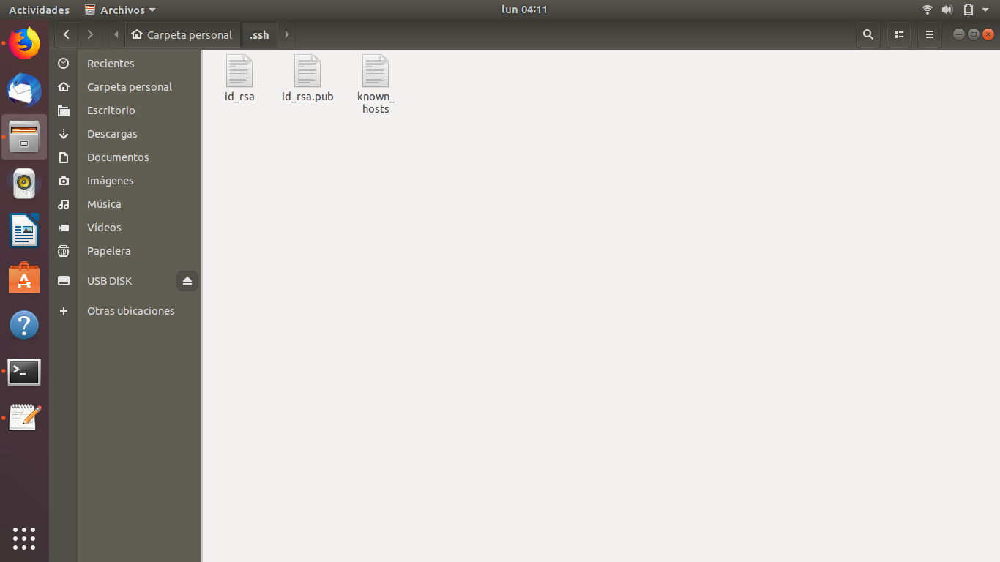
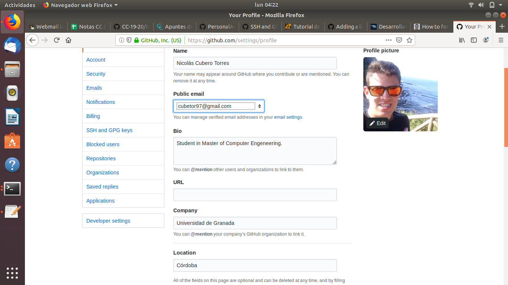
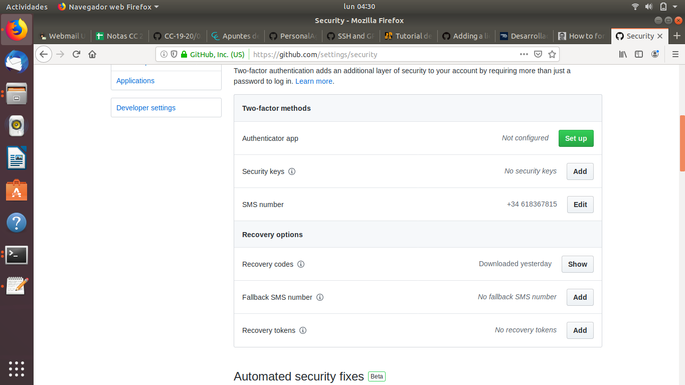

#	Establecimiento del entorno

Para el establecimiento y configuración del entorno requerido, se llevaron a cabo el siguiente proceso:

**Nota: La ejecución de este procedimiento se apli**

1. **Instalación del programa git**: Se instala el programa *git* desde la **línea de comandos** introduciendo el siguiente comando: `sudo apt-get install git`.

2. **Creación del par de claves y subida de la clave pública a Github**: Desde la línea de comandos, se ejecuta el comando `ssh-keygen -t rsa -C "cubetor97@gmail.com"` para la creación del par de un par de claves usando el algoritmo *rsa*.

3. **Configuración de un nombre y un correo electrónico para la firma de los commits**: Se configura el nombre "Nicolás Cubero" y el correo "cubetor97@gmail.com" usando los comandos `git config --global user.name "Nicolás Cubero"` y `git config --global user.email "cubetor97@gmail.com"` respectivamente.

4. **Configuración de los datos personales en el perfil de usuario**: Se configura el nombre completo, ciudad, universidad y se establece una imagen de perfil desde la página de configuración de perfil de usuario, a la cual se accede en `Settings -> Profile`. La configuración queda de la siguiente forma:

5. **Configuración y establecimiento del doble factor de configuración**: Se selecciona `Settings -> Segurity -> Two-factor-authentication` y se habilita. En este caso, se ha optado por la verificación mediante el envío de SMS, para lo cual, Github solicita el número de teléfono al cual se remitirán los mensajes con los códigos de verificación.

Una vez configurado este aspecto, el estado de esta sección de la pantalla de configuración queda de la siguiente forma:

